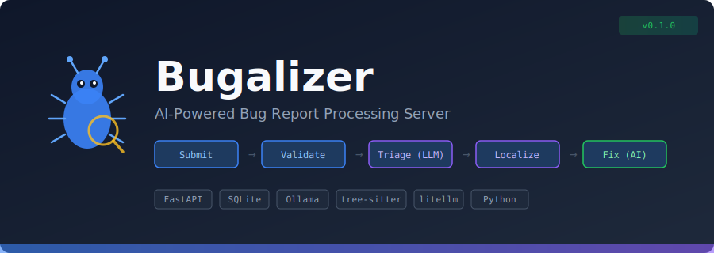

<p align="center">
  
</p>

# Bugalizer

An AI-powered bug report processing server. Bugalizer accepts structured bug reports via REST API, queues them through a multi-stage AI pipeline, and progressively enriches them with automated triage, code localization, and (eventually) fix proposals.

## How It Works

Bug reports flow through a tiered pipeline, each stage adding intelligence:

```
Submit  -->  Validate  -->  Triage (LLM)  -->  Localize (LLM)  -->  Fix (AI)
  |             |               |                   |                  |
  |        Extract data    Classify bug,       Find relevant      Generate fix
  |        Detect dupes    set severity,       files/functions,   proposals
  |                        identify area       root cause         (planned)
  v                                            hypothesis
Report stored in DB, status tracked through 13-state workflow
```

**Stage 1 — Validate** (no LLM): Extracts structured data (URLs, file paths, stack traces), detects duplicate reports via text similarity.

**Stage 2 — Triage** (Ollama): Sends the report to a local LLM for classification. Sets severity, identifies feature area, flags reports needing clarification.

**Stage 3 — Localize** (Ollama): Builds an AST-based repo map using tree-sitter, sends it with the bug report to the LLM to identify candidate source files. A confirmation pass reads the actual file contents to pinpoint specific functions and line ranges.

**Stage 4 — Fix** (planned): Will use cloud LLMs to generate fix proposals with diffs.

## Features

- **REST API** with OpenAPI docs, API key authentication, two-tier field validation
- **13-state bug workflow** with enforced transition rules and phase gating
- **Async queue worker** with bounded concurrency, automatic retry with backoff
- **Local LLM integration** via Ollama (no cloud dependency for triage/localization)
- **Git repo management** — clone project repos, track HEAD SHA for cache invalidation
- **AST-based repo maps** — tree-sitter parsing of Python, JS/TS, Go, Rust, Java
- **Two-pass code localization** — cheap first pass narrows scope, detailed second pass on confident matches
- **SQLite storage** with WAL mode, write locking, and automatic schema migrations
- **Token usage tracking** per project and per report

## Quick Start

### Prerequisites

- Python 3.11+
- Git (for repo cloning features)
- [Ollama](https://ollama.ai/) (for LLM-powered stages)

### Install

```bash
git clone https://github.com/your-org/bugalizer.git
cd bugalizer
python -m venv .venv
source .venv/bin/activate   # or .venv\Scripts\activate on Windows
pip install -e ".[dev]"
```

### Run Tests

```bash
pytest
# 113 tests, all should pass (no Ollama required — LLM calls are mocked)
```

### Start the Server

```bash
# Pull an Ollama model for triage/localization
ollama pull qwen2.5-coder:7b

# Start Bugalizer
BUGALIZER_DB_PATH=bugalizer.db uvicorn bugalizer.main:app --port 8090
```

API docs available at [http://localhost:8090/docs](http://localhost:8090/docs).

### Submit a Bug Report

```bash
# Create a project
curl -X POST http://localhost:8090/api/v1/projects \
  -H "Content-Type: application/json" \
  -d '{"name": "My App", "repo_url": "https://github.com/user/myapp"}'

# Submit a bug report (use the project ID from above)
curl -X POST http://localhost:8090/api/v1/reports \
  -H "Content-Type: application/json" \
  -d '{
    "project_id": "PROJECT_ID_HERE",
    "title": "Login button does not respond",
    "description": "Clicking the login button on the main page does nothing. No network request is made.",
    "reporter": "jane@example.com",
    "severity": "high",
    "steps_to_reproduce": ["Go to /login", "Enter credentials", "Click Login button"],
    "expected_behavior": "Should redirect to dashboard",
    "actual_behavior": "Nothing happens, no errors in console"
  }'
```

The queue worker automatically picks up the report and runs it through the pipeline stages.

## Configuration

All settings use the `BUGALIZER_` environment variable prefix:

| Variable | Default | Description |
|----------|---------|-------------|
| `BUGALIZER_DB_PATH` | `bugalizer.db` | SQLite database path |
| `BUGALIZER_API_KEYS` | _(empty = auth disabled)_ | Comma-separated API keys |
| `BUGALIZER_OLLAMA_HOST` | `http://localhost:11434` | Ollama server URL |
| `BUGALIZER_DEFAULT_TRIAGE_MODEL` | `qwen2.5-coder:7b` | Model for Stage 2 triage |
| `BUGALIZER_DEFAULT_LOCALIZE_MODEL` | `qwen2.5-coder:7b` | Model for Stage 3 localization |
| `BUGALIZER_REPOS_DIR` | `./repos` | Directory for cloned git repos |
| `BUGALIZER_CACHE_DIR` | `./cache` | Directory for repo map cache |
| `BUGALIZER_QUEUE_ENABLED` | `true` | Enable/disable background worker |
| `BUGALIZER_QUEUE_POLL_SECONDS` | `5` | Worker poll interval |
| `BUGALIZER_QUEUE_MAX_CONCURRENT` | `2` | Max concurrent pipeline tasks |
| `BUGALIZER_DUPLICATE_THRESHOLD` | `0.8` | Similarity threshold for duplicate detection |
| `BUGALIZER_LOCALIZE_CONFIDENCE_THRESHOLD` | `0.5` | Min confidence for localization Pass 2 |

## API Endpoints

### Reports
| Method | Endpoint | Description |
|--------|----------|-------------|
| `POST` | `/api/v1/reports` | Submit a bug report |
| `GET` | `/api/v1/reports` | List reports (filter by project, status) |
| `GET` | `/api/v1/reports/{id}` | Get a single report |
| `PATCH` | `/api/v1/reports/{id}/status` | Update report status |
| `GET` | `/api/v1/reports/{id}/localization` | Get localization results |
| `DELETE` | `/api/v1/reports/{id}` | Soft-delete a report |

### Projects
| Method | Endpoint | Description |
|--------|----------|-------------|
| `POST` | `/api/v1/projects` | Create a project |
| `GET` | `/api/v1/projects` | List projects |
| `GET` | `/api/v1/projects/{id}` | Get a project |
| `PATCH` | `/api/v1/projects/{id}` | Update project settings |
| `POST` | `/api/v1/projects/{id}/clone` | Clone/update project repo |
| `POST` | `/api/v1/projects/{id}/refresh-map` | Force rebuild repo map |
| `GET` | `/api/v1/projects/{id}/repo-map` | View current repo map |
| `DELETE` | `/api/v1/projects/{id}` | Delete a project |

### Queue & Usage
| Method | Endpoint | Description |
|--------|----------|-------------|
| `GET` | `/api/v1/queue` | Queue status overview |
| `POST` | `/api/v1/queue/{id}/retry` | Reset failed triage retries |
| `GET` | `/api/v1/usage` | Aggregate token usage |
| `GET` | `/api/v1/usage/{project_id}` | Per-project token usage |

## Architecture

```
                                    +------------------+
                                    |   Ollama (local)  |
                                    |  qwen2.5-coder   |
                                    +--------+---------+
                                             |
  Client  -->  FastAPI  -->  Queue Worker  --+-->  Pipeline
    |            |              |                     |
    |         REST API     Async poll loop    Stage 1: Validate
    |         Auth (key)   Semaphore bound    Stage 2: Triage (LLM)
    |         Validation   Retry/backoff      Stage 3: Localize (LLM)
    |                                         Stage 4: Fix (planned)
    |                                                |
    +--  SQLite (WAL mode)  <------------------------+
         bug_reports, projects, analyses, token_usage
```

- **Standalone service** — no external dependencies except Ollama and Git
- **SQLite** with WAL mode for concurrent reads, asyncio.Lock for serialized writes
- **Atomic claim** pattern prevents double-processing under concurrency
- **tree-sitter** AST parsing for multi-language repo map building
- **SHA-based caching** — repo maps invalidated when HEAD changes

## Project Status

| Phase | Status | Description |
|-------|--------|-------------|
| 1. Foundation | Complete | REST API, DB, auth, 13-state workflow |
| 2. Local LLM Pipeline | Complete | Ollama triage, async queue, duplicate detection |
| 3. Codebase Analysis | Complete | Git ops, repo maps, two-pass localization |
| 4. Fix Proposals | Planned | Cloud LLM fix generation, diffs, PRs |
| 5. Dashboard | Planned | Web UI for monitoring and management |
| 6. Integrations | Planned | Webhooks, external bug trackers |

## Development

This project uses an AI handoff workflow between Claude (lead) and Codex (reviewer) for plan/implementation review cycles. See `docs/handoffs/` for review history.

### Claude Skills

| Skill | Description |
|-------|-------------|
| `/test` | Run and analyze tests |
| `/phase` | Phase status dashboard |
| `/review` | Pre-submission code review checklist |
| `/pii-scan` | PII data flow audit |
| `/security-check` | OWASP-based security audit |
| `/handoff` | AI handoff workflow |

## License

MIT
